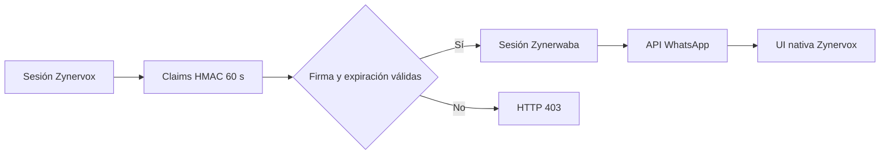

# Integración omnicanal WhatsApp

- Estado: Parcial
- Criticidad: Alta
- Responsable: Zynervox
- Última verificación: 2026-10-01
- Versión verificada: `feature/native-whatsapp-api-integration`

## Propósito

Operar WhatsApp desde la interfaz Zynervox conservando Zynerwaba como servicio especializado y fuente de verdad.

## Alcance

- Inicio: un usuario autenticado abre `modules/admin/whatsapp.php`.
- Final correcto: la sesión integrada permite consultar y operar recursos autorizados por la API.
- Fuera de alcance: credenciales Meta reales y prueba E2E con un destinatario externo.

## Actores y sistemas

| Actor o sistema | Responsabilidad | Evidencia |
|---|---|---|
| Zynervox PHP | Autoriza al usuario y firma claims temporales | `app/web/modules/admin/whatsapp.php` |
| Zynerwaba | Valida SSO y ejecuta la lógica WhatsApp | `whatsapp/overrides/src/features/empresas/index.js` |
| Apache | Publica la API bajo la misma procedencia | `installer/apache-whatsapp.conf.template` |
| MySQL WhatsApp | Persiste sesiones, usuarios, contactos y mensajes | `whatsapp/compose.yml` |

## Condiciones previas

- Zynervox y Zynerwaba saludables.
- Mismo `ZYNERVOX_SSO_SECRET` en el contenedor y `/etc/zynervox/whatsapp.conf`.
- Empresa y líneas activas para operaciones tenant.

## Entradas y salidas

| Tipo | Dato/contrato | Origen o destino | Validación |
|---|---|---|---|
| Entrada | claims usuario, nivel, empresa y expiración | Zynervox → `/api/sso/zynervox` | HMAC-SHA256 y máximo 90 segundos |
| Salida | cookie de sesión HTTP-only | Zynerwaba → navegador | usuario activo y empresa válida |
| Salida | recursos WhatsApp | API Zynerwaba → interfaz Zynervox | rol y `X-Empresa-Id` |

## Diagrama

## Secuencia principal

1. PHP valida nivel 7, 8 o 9 y firma claims sin contraseña.
2. El navegador intercambia los claims mediante `POST /api/sso/zynervox`.
3. Zynerwaba crea o actualiza la identidad enlazada `zv_<usuario>` y guarda la sesión.
4. La interfaz consulta empresas, contactos, mensajes, campañas, usuarios y líneas según el rol.
5. Socket.IO actualiza mensajes y contactos en tiempo real.

## Decisiones y variantes

| Decisión | Condición | Camino | Consecuencia |
|---|---|---|---|
| Rol | nivel 9 | superadmin | selecciona empresa explícita |
| Rol | nivel 8 | supervisor | opera su empresa configurada |
| Rol | nivel 7 | admin | administra su empresa configurada |

## Estados e invariantes

- Nunca se comparte una contraseña entre aplicaciones.
- PHP nunca consulta tablas internas de Zynerwaba.
- Toda operación tenant conserva `empresa_id`.

## Errores, reintentos y recuperación

| Fallo | Detección | Reintento/compensación | Intervención |
|---|---|---|---|
| secreto ausente | SSO 403 | repetir `init` e `install-proxy` | operador del servidor |
| token vencido | SSO 403 | recargar la página | usuario |
| contenedor no saludable | smoke test | reiniciar solo el stack WhatsApp | operador |

## Seguridad y datos sensibles

El secreto no se versiona ni se envía al navegador. Solo la firma sale de PHP. Las cookies son HTTP-only y limitadas al `BASE_PATH`.

## Observabilidad y operación

- Error SSO: prefijo `[sso] zynervox` en logs del contenedor.
- Verificación: `src/features/whatsapp/tests/smoke.sh`.
- Recuperación: reinstalar proxy, reiniciar solo `zynervox-whatsapp-app` y repetir smoke.

## Implementación

| Componente | Ruta/símbolo | Función dentro del flujo |
|---|---|---|
| UI | `app/web/modules/admin/whatsapp.php` | interfaz y firma temporal |
| SSO | `POST /api/sso/zynervox` | intercambio de identidad |
| Instalador | `installer/whatsapp.sh` | generación y distribución del secreto |
| Runtime | `whatsapp/compose.yml` | inyección del secreto al contenedor |

## Pruebas

| Prueba/comando | Cobertura | Último resultado |
|---|---|---|
| `smoke.sh` | firma SSO, login, sesión, socket y persistencia | Pendiente de despliegue de esta rama |
| navegador | UI y flujos API | Pendiente de despliegue de esta rama |

## Evidencia pendiente

- Envío y recepción reales requieren credenciales Meta y línea exclusiva de laboratorio.

## Historial

| Fecha | Cambio operativo | Evidencia/versión |
|---|---|---|
| 2026-10-01 | Primera integración nativa con SSO firmado | rama de integración |
